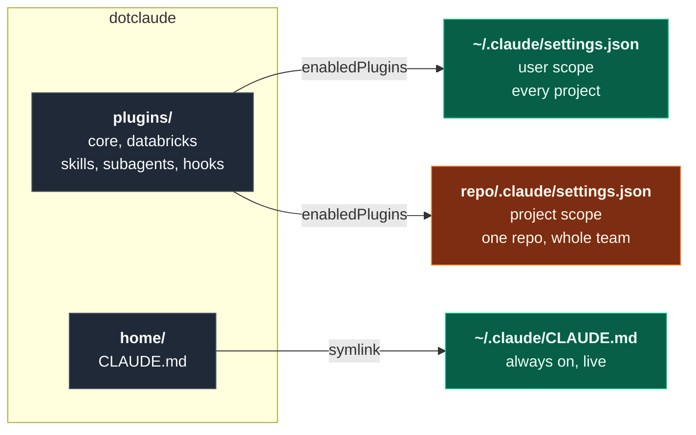

<div align="center">

# dotclaude

**Version-controlled agent configuration: Claude Code instructions, skills, subagents and enforcing hooks shipped as plugins, plus Genie Code skills published straight to Databricks.**

[](https://code.claude.com/docs/en/plugin-marketplaces)
[](https://docs.databricks.com/aws/en/genie-code/)
[](https://code.claude.com/docs/en/skills)
[](https://code.claude.com/docs/en/sub-agents)
[](install.sh)

</div>

---

## The idea

This repo treats agent configuration as software: written once, reviewed, committed, and
delivered to where it is needed. Almost all of it is a **plugin**, because a plugin is
installable at whichever scope the consumer picks:

| Scope | Enabled in | Reaches |
|---|---|---|
| `user` | `~/.claude/settings.json` | every project on the machine |
| `project` | `<repo>/.claude/settings.json` | that repo, everyone who clones it |
| `local` | `<repo>/.claude/settings.local.json` | that repo, only you, gitignored |

So "global or per project" is not a property of the thing. It is one line in whichever
settings file you choose, decided at install time rather than baked in here.



The test is no longer "global or per project", it is **can a plugin carry this?** Two things
cannot, and they are the whole reason `home/` still exists:

- **`CLAUDE.md`**. Per the [plugin reference](https://code.claude.com/docs/en/plugins-reference),
  a `CLAUDE.md` at a plugin root is not loaded as context. Plugins contribute through skills,
  agents and hooks instead. A skill is no substitute for always-on personal rules, because
  skills load on demand.
- **`settings.json`**. A plugin's own `settings.json` supports only the `agent` and
  `subagentStatusLine` keys, and it is a file Claude Code writes to. See
  [Gotchas](#gotchas-worth-knowing).

Everything else is a plugin.

---

## What is in here

Subagents are read only throughout: they report findings and never rewrite code.

### `plugins/core`, domain neutral

Safe in any repo, Databricks or not. Enable it at user scope and it behaves like the old
global half did.

| | Kind | Does |
|---|---|---|
| [`security-scanner`](plugins/core/agents/security-scanner.md) | Subagent | Vulnerabilities, secrets, dependencies, IaC misconfig in a diff |
| [`docs-drift-checker`](plugins/core/agents/docs-drift-checker.md) | Subagent | Verifies every README and diagram claim against the actual repo |
| [`house-style-docs`](plugins/core/skills/house-style-docs/SKILL.md) | Skill | README structure, prose rules, Mermaid on GitHub |
| [`format-on-save.sh`](plugins/core/hooks/format-on-save.sh) | Hook, PostToolUse | Formats after every Write or Edit, best effort and silent |

### `plugins/databricks`, only where it applies

Deltas from ordinary Databricks practice. Platform knowledge itself comes from
[`databricks-agent-skills`](https://github.com/databricks/databricks-agent-skills),
installed alongside.

| | Kind | Does |
|---|---|---|
| [`cost-perf-auditor`](plugins/databricks/agents/cost-perf-auditor.md) | Subagent | Spark and layout anti-patterns, ranked by what they cost |
| [`schema-impact`](plugins/databricks/agents/schema-impact.md) | Subagent | Blast radius of a schema change, including silently-wrong readers |
| [`databricks-conventions`](plugins/databricks/skills/databricks-conventions/SKILL.md) | Skill | UC only, three fixed targets, secrets on Free Edition |
| [`lakeflow-review`](plugins/databricks/skills/lakeflow-review/SKILL.md) | Skill | dp API spelling, Python pipelines only, transformations stay declarative |
| [`lakeflow-jobs`](plugins/databricks/skills/lakeflow-jobs/SKILL.md) | Skill | Notebook house style: DataFrame API only, fixed cell layout |
| [`databricks-remote-checkpoint`](plugins/databricks/skills/databricks-remote-checkpoint/SKILL.md) | Skill | Stops and asks before moving from local checks to bundle validate, deploy, run, or SQL MCP |
| [`guard-conventions.py`](plugins/databricks/hooks/guard-conventions.py) | Hook, PreToolUse | **Blocks** a write containing a DBFS path, `/mnt/`, `dbutils.fs` or `@dlt.table` |

That last row is the point of shipping conventions as a plugin. A convention written in a
`CLAUDE.md` is a request the model can drift from. The same convention in a PreToolUse hook
exits 2 and the write does not happen. Installing the plugin carries the enforcement with
it, because plugin hooks activate on install with no per-project wiring to copy around.

### `genie-code/`, published to Databricks, not a plugin

Source content for [Genie Code](https://docs.databricks.com/aws/en/genie-code/) skills,
Databricks' own AI coding assistant, built into notebooks, the SQL editor, the Lakeflow
Pipelines Editor and more. Not a Claude Code plugin, so it lives outside `plugins/`: CI
publishes `genie-code/skills/` to `/Workspace/Shared/genie-code-skills/` as a catalog on
every merge to `main` ([`deploy-genie-code-skills.yml`](.github/workflows/deploy-genie-code-skills.yml)).
Genie Code itself only auto-scans `/Workspace/.assistant/skills/`, so enabling a skill there
is a separate, deliberate step, not automatic.

| | Does |
|---|---|
| [`genie-code-conventions`](genie-code/skills/genie-code-conventions/SKILL.md) | UC only, no DBFS |
| [`genie-code-lakeflow-jobs`](genie-code/skills/genie-code-lakeflow-jobs/SKILL.md) | Notebook house style: DataFrame API only, fixed cell layout |
| [`genie-code-populate-pipeline-files`](genie-code/skills/genie-code-populate-pipeline-files/SKILL.md) | Batch pattern for bulk-creating and filling in empty pipeline files |

### `home/`, the one exception

| | Kind | Does |
|---|---|---|
| [`CLAUDE.md`](home/CLAUDE.md) | Instructions | How I work: branch and PR discipline, docstrings, writing style |

---

## Repo map

```
dotclaude/
├── .claude-plugin/
│   └── marketplace.json          catalog, makes this repo installable
├── plugins/                      installed at user or project scope
│   ├── core/                     domain neutral, safe anywhere
│   │   ├── agents/               security-scanner, docs-drift-checker
│   │   ├── hooks/                hooks.json + format-on-save.sh
│   │   └── skills/               house-style-docs
│   └── databricks/               only for repos that touch Databricks
│       ├── agents/               cost-perf-auditor, schema-impact
│       ├── hooks/                hooks.json + guard-conventions.py
│       └── skills/               databricks-conventions, lakeflow-review,
│                                 lakeflow-jobs, databricks-remote-checkpoint
├── home/
│   └── CLAUDE.md                 global instructions, the only symlink
├── genie-code/                   published to Databricks, not a plugin
│   └── skills/                   genie-code-conventions, genie-code-lakeflow-jobs,
│                                 genie-code-populate-pipeline-files
├── evals/                        does the config behave as intended
│   ├── triggers.yaml             prompt -> expected skill or agent
│   ├── fixtures/                 files with planted violations
│   └── run.py                    harness, reports rates not pass/fail
├── scripts/
│   └── validate.py               deterministic config checks, runs in CI
├── templates/
│   ├── user-settings.json        copy into ~/.claude/settings.json
│   └── project-settings.json     copy into a project to opt in
└── install.sh                    links home/CLAUDE.md, prunes retired links
```

---

## Setup

Link the one global file, then install the plugins:

```bash
git clone git@github.com:schmucas/dotclaude.git ~/git-repos/dotclaude
./dotclaude/install.sh --dry   # preview, touches nothing
./dotclaude/install.sh         # links ~/.claude/CLAUDE.md, nothing else
```

```bash
claude plugin marketplace add schmucas/dotclaude
claude plugin install core@schmucas-dotclaude
```

Or copy the keys from [`templates/user-settings.json`](templates/user-settings.json) into
`~/.claude/settings.json` and let Claude Code offer the install on next launch. Note that
the marketplace registers under the `name` in
[`marketplace.json`](.claude-plugin/marketplace.json), so plugins resolve as
`core@schmucas-dotclaude`. If `claude plugin list` shows a plugin enabled under a name no
marketplace provides, it is silently not loading.

Per project, commit [`templates/project-settings.json`](templates/project-settings.json) to
`<project>/.claude/settings.json`. Claude Code offers to install the listed plugins when the
folder is first trusted, so a fresh clone is configured with no manual step. The repo
carries its own agent configuration the same way it carries its own linter config.

---

## Testing the configuration

The repo argues that agent configuration is software. These two make that testable rather
than merely asserted.

**`scripts/validate.py`, deterministic, blocking.** Frontmatter present and matching its
directory, descriptions long enough to trigger, JSON parsing, marketplace entries resolving
to real plugins, hook commands resolving through `${CLAUDE_PLUGIN_ROOT}` and existing and
executable and carrying a shebang, `install.sh` linking only files that exist and never
`settings.json`, every name in the eval suite resolving to a real skill, no em-dashes, no
dead README links. Runs on every pull request, and locally in under a second:

```bash
pip install pyyaml
python3 scripts/validate.py
```

Frontmatter is parsed with a real YAML loader rather than a regex, because Claude Code uses
one too. An unquoted `description` containing `: ` parses as a nested mapping, the block is
dropped at load time, and the skill silently never triggers. A regex reads that file as
healthy, which is exactly how two skills here sat dead without anything noticing.

**`evals/`, statistical, advisory.** A skill fails in two unrelated ways: it does not
trigger when it should, or it triggers and gets the answer wrong. The first is a property
of the `description` field alone and is stochastic, so the harness runs each prompt
several times and reports a rate:

```bash
python3 evals/run.py --runs 5
```

A skill that fires 7 times in 10 is a real defect that a single run hides completely. The
prompts that matter are the near misses, the pairs the set is genuinely at risk of
confusing: `lakeflow-review` against `cost-perf-auditor` when a review is really a
performance question, `house-style-docs` against `docs-drift-checker`, `lakeflow-jobs`
against `lakeflow-review`. Negative cases assert that an ordinary Python question loads
nothing at all.

---

## Design notes

**A plugin is a cached copy, so develop against the checkout.** Installing from the
marketplace copies the plugin into `~/.claude/plugins/cache/` at a pinned version, so
editing this repo changes nothing until `/plugin marketplace update`. That is the right
default for something shared and the wrong one for an edit-and-test loop. For the loop, load
the checkout directly, which takes precedence over the installed copy for that session:

```bash
claude --plugin-dir ./plugins/core
```

**Databricks work is three decoupled layers, on purpose.** A repo that builds on
Databricks gets its agent configuration from three independent sources, and none of them
owns the others:

| Layer | Source | Owns | Changes when |
|---|---|---|---|
| Rules and style | `databricks@schmucas-dotclaude`, this repo | Conventions of these repos, enforced by hook | I change my mind |
| Platform knowledge | [`databricks@databricks-agent-skills`](https://github.com/databricks/databricks-agent-skills) | How Databricks itself works | Databricks ships something |
| Workspace connection | the project's own `.mcp.json` | Which workspace, which credentials | The workspace does |

Each is enabled or removed on its own, in one line of the project's
`.claude/settings.json` for the first two and one file for the third.

---

## Gotchas worth knowing

**`settings.json` is never symlinked, and `install.sh` refuses to.** It is the one file in
`~/.claude` that Claude Code *writes* to: `/plugin`, `/theme`, effort level, the
enable-on-trust prompt and `pluginConfigs` all mutate it. Link it into a git working tree and
the app edits this repo behind your back, the tree goes dirty on its own, and machine-local
state is one `git commit -a` away from a public repo. This repo made that mistake once, so
`validate.py` now fails the build if `settings.json` reappears in the installer's `LINKS`.
The committed reference lives at
[`templates/user-settings.json`](templates/user-settings.json) and is copied, never linked.

**Why exactly one symlink survives.** `~/.claude/CLAUDE.md` and a project's `./CLAUDE.md` are
different files serving different jobs, and they concatenate rather than override: the first
is personal preference across every project, the second is team instruction shared through
source control. Everything in [`home/CLAUDE.md`](home/CLAUDE.md) is the first kind, so it
cannot live in project repos. The symlink itself is a dotfiles technique rather than a Claude
Code requirement: Claude Code just wants a file at that path, and the link exists only
because you cannot check a git repo out into `~/.claude`, which Claude Code owns. Copying
would work too, right up until the live file is edited directly and the two silently drift.

**Nothing secret belongs in this repo, since it is public.** Machine-specific overrides go
in `settings.local.json`, which is gitignored.

---

## Reference

[Plugin marketplaces](https://code.claude.com/docs/en/plugin-marketplaces) ·
[Creating plugins](https://code.claude.com/docs/en/plugins) ·
[Plugins reference](https://code.claude.com/docs/en/plugins-reference) ·
[Subagents](https://code.claude.com/docs/en/sub-agents) ·
[Agent Skills](https://code.claude.com/docs/en/skills) ·
[Settings](https://code.claude.com/docs/en/settings) ·
[Memory and CLAUDE.md](https://code.claude.com/docs/en/memory)
