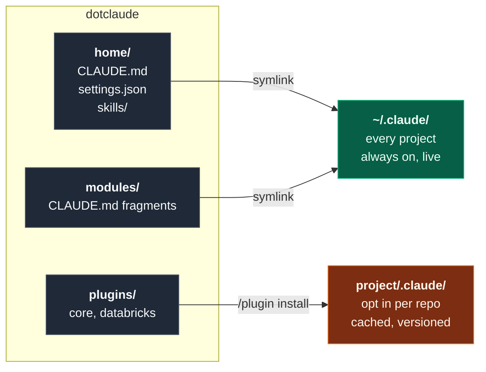

<div align="center">

# dotclaude

**Version-controlled Claude Code configuration: global instructions, reusable skills, and subagents, delivered two different ways from one repo.**

[](https://code.claude.com/docs/en/plugin-marketplaces)
[](https://code.claude.com/docs/en/skills)
[](https://code.claude.com/docs/en/sub-agents)
[](install.sh)

</div>

---

## The idea

This repo treats agent configuration as software: written once, reviewed, committed,
and delivered to where it is needed. The design question that shapes everything else is
**does this belong everywhere, or only in some projects?**

Those two answers need two different delivery mechanisms, so the repo has two halves.



| | Global half | Per project half |
|---|---|---|
| **Mechanism** | symlinks into `~/.claude` | plugin marketplace |
| **Scope** | every project on the machine | only repos that opt in |
| **Updates** | live, edit or `git pull` | on demand, `/plugin marketplace update` |
| **Holds** | how I work, style, always-on skills | domain skills, subagents, commands |
| **Good for** | facts about *me* | facts about *a kind of work* |

The test for where something goes: *would this be noise in an unrelated project?*
If yes, it is a plugin. If no, it is global.

---

## What is in here

### Subagent: `security-scanner`

`plugins/core/agents/security-scanner.md`

### Skill: `lakeflow-review`

`plugins/databricks/skills/lakeflow-review/SKILL.md`

---

## Repo map

```
dotclaude/
├── .claude-plugin/
│   └── marketplace.json          catalog, makes this repo installable
├── home/                         symlinked into ~/.claude, always on
│   ├── CLAUDE.md                 global instructions
│   ├── settings.json             global settings + marketplace registration
│   └── skills/                   skills available in every project
├── modules/                      CLAUDE.md fragments, imported on demand
│   └── databricks-conventions.md
├── plugins/                      installed per project
│   ├── core/
│   │   └── agents/security-scanner.md
│   └── databricks/
│       └── skills/lakeflow-review/SKILL.md
├── templates/
│   └── project-settings.json     drop into a new project to opt in
└── install.sh                    idempotent symlink installer
```

---

## Setup

### Once per machine

```bash
git clone git@github.com:schmucas/dotclaude.git ~/git-repos/dotclaude
cd ~/git-repos/dotclaude
./install.sh --dry     # preview, touches nothing
./install.sh
```

Resulting links:

```
~/.claude/CLAUDE.md     -> dotclaude/home/CLAUDE.md
~/.claude/settings.json -> dotclaude/home/settings.json
~/.claude/skills        -> dotclaude/home/skills
~/.claude/modules       -> dotclaude/modules
```

Symlinks are pointers, not copies, so a `git pull` updates every project on the machine
with nothing to reinstall. The installer is idempotent and backs up any real file
already sitting at a target path instead of overwriting it. `--unlink` reverses it.

### Per project

Register the marketplace once:

```
/plugin marketplace add schmucas/dotclaude
```

Then install where wanted:

```
/plugin install databricks@luca
```

Or commit `templates/project-settings.json` to `<project>/.claude/settings.json`, and
Claude Code offers to install the listed plugins when the folder is first trusted. A
fresh clone of that project is then configured with no manual step, which is the point:
the repo carries its own agent configuration the same way it carries its own linter
config.

---

## Design notes

**Plugins are cached copies, symlinks are live.** Fast-moving personal preferences go in
`home/` so they take effect immediately. Stable, shareable capability goes in `plugins/`
so it updates deliberately and stays pinned until asked.

---

## Gotchas worth knowing

Installing a plugin copies its directory into a cache, so a plugin cannot reference
paths outside itself such as `../shared`. Shared content must be duplicated, or
symlinked inside the plugin directory.

`@path` imports resolve up to four hops deep, relative to the importing file rather than
the working directory.

Nothing secret belongs in this repo, since it is public. Machine-specific overrides go
in `settings.local.json`, which is gitignored.

---

## Reference

[Plugin marketplaces](https://code.claude.com/docs/en/plugin-marketplaces) ·
[Creating plugins](https://code.claude.com/docs/en/plugins) ·
[Subagents](https://code.claude.com/docs/en/sub-agents) ·
[Agent Skills](https://code.claude.com/docs/en/skills) ·
[Settings](https://code.claude.com/docs/en/settings) ·
[Memory and CLAUDE.md](https://code.claude.com/docs/en/memory)
