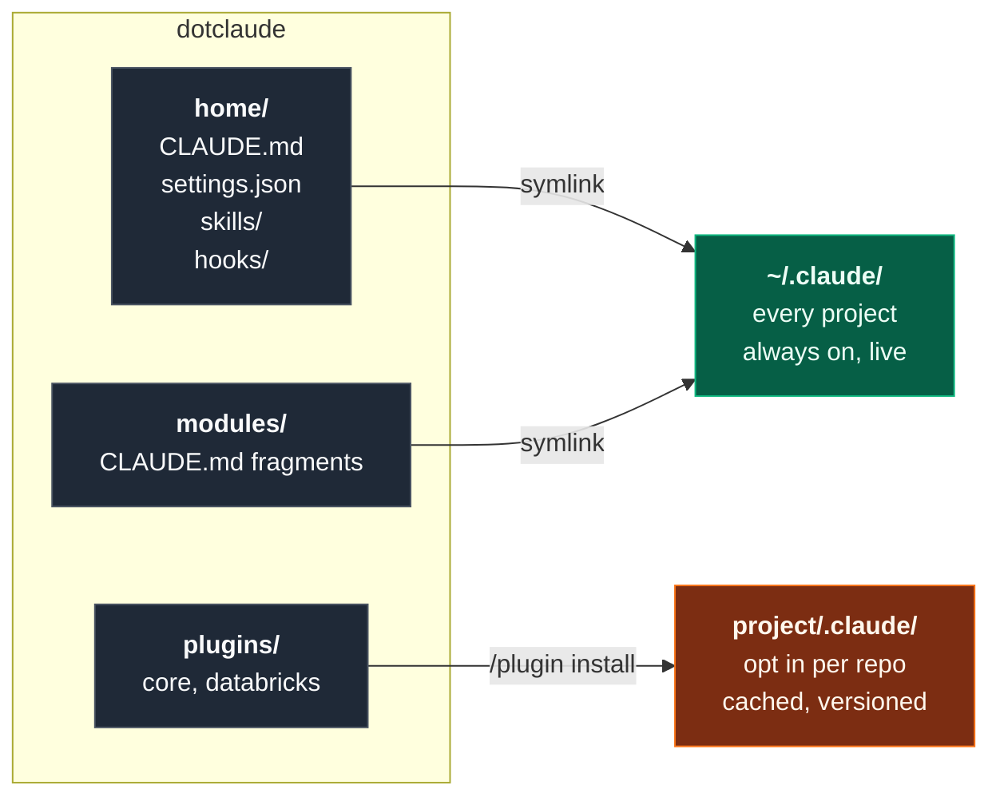

<div align="center">

# dotclaude

**Version-controlled Claude Code configuration: instructions, skills, subagents and enforcing hooks, delivered two different ways from one repo.**

[](https://code.claude.com/docs/en/plugin-marketplaces)
[](https://code.claude.com/docs/en/skills)
[](https://code.claude.com/docs/en/sub-agents)
[](install.sh)

</div>

---

## The idea

This repo treats agent configuration as software: written once, reviewed, committed,
and delivered to where it is needed. The design question that shapes everything else is
**does this belong everywhere, or only in some projects?**

Those two answers need two different delivery mechanisms, so the repo has two halves.



| | Global half | Per project half |
|---|---|---|
| **Mechanism** | symlinks into `~/.claude` | plugin marketplace |
| **Scope** | every project on the machine | only repos that opt in |
| **Updates** | live, edit or `git pull` | on demand, `/plugin marketplace update` |
| **Holds** | how I work, style, always-on skills | domain skills, subagents, hooks |
| **Good for** | facts about *me* | facts about *a kind of work* |

The test for where something goes: *would this be noise in an unrelated project?*
If yes, it is a plugin. If no, it is global.

---

## What is in here

Grouped by where it lives, because where something lives is the decision. Subagents are
read only throughout: they report findings and never rewrite code.

### `home/`, the global half

Symlinked into `~/.claude`, so it is on in every project on the machine.

| | Kind | Does |
|---|---|---|
| [`CLAUDE.md`](home/CLAUDE.md) | Instructions | How I work: branch and PR discipline, docstrings, writing style |
| [`settings.json`](home/settings.json) | Settings | Marketplace registration, always-on plugins, hook wiring |
| [`format-on-save.sh`](home/hooks/format-on-save.sh) | Hook, PostToolUse | Formats after every Write or Edit |
| [`modules/`](modules/) | Fragments | `CLAUDE.md` sections imported on demand rather than always loaded |

### `plugins/core`, domain neutral

Safe in any repo, Databricks or not.

| | Kind | Does |
|---|---|---|
| [`security-scanner`](plugins/core/agents/security-scanner.md) | Subagent | Vulnerabilities, secrets, dependencies, IaC misconfig in a diff |
| [`docs-drift-checker`](plugins/core/agents/docs-drift-checker.md) | Subagent | Verifies every README and diagram claim against the actual repo |
| [`house-style-docs`](plugins/core/skills/house-style-docs/SKILL.md) | Skill | README structure, prose rules, Mermaid on GitHub |

### `plugins/databricks`, only where it applies

Deltas from ordinary Databricks practice. Platform knowledge itself comes from
[`databricks-agent-skills`](https://github.com/databricks/databricks-agent-skills),
installed alongside.

| | Kind | Does |
|---|---|---|
| [`cost-perf-auditor`](plugins/databricks/agents/cost-perf-auditor.md) | Subagent | Spark and layout anti-patterns, ranked by what they cost |
| [`schema-impact`](plugins/databricks/agents/schema-impact.md) | Subagent | Blast radius of a schema change, including silently-wrong readers |
| [`databricks-conventions`](plugins/databricks/skills/databricks-conventions/SKILL.md) | Skill | UC only, three fixed targets, secrets on Free Edition |
| [`lakeflow-review`](plugins/databricks/skills/lakeflow-review/SKILL.md) | Skill | dp API spelling, Python pipelines only, transformations stay declarative |
| [`lakeflow-jobs`](plugins/databricks/skills/lakeflow-jobs/SKILL.md) | Skill | Notebook house style: DataFrame API only, fixed cell layout |
| [`guard-conventions.py`](plugins/databricks/hooks/guard-conventions.py) | Hook, PreToolUse | **Blocks** a write containing a DBFS path, `/mnt/`, `dbutils.fs` or `@dlt.table` |

That last row is the point of the plugin half. A convention written in a `CLAUDE.md` is a
request the model can drift from. The same convention in a PreToolUse hook exits 2 and
the write does not happen. Installing the plugin carries the enforcement with it, because
plugin hooks activate on install with no per-project wiring to copy around.

---

## Repo map

```
dotclaude/
├── .claude-plugin/
│   └── marketplace.json          catalog, makes this repo installable
├── home/                         symlinked into ~/.claude, always on
│   ├── CLAUDE.md                 global instructions
│   ├── settings.json             global settings + marketplace registration
│   ├── skills/                   skills available in every project
│   └── hooks/                    hook scripts referenced from settings.json
├── modules/                      CLAUDE.md fragments, imported on demand
│   └── databricks-conventions.md
├── plugins/                      installed per project
│   ├── core/                     domain neutral, safe anywhere
│   │   ├── agents/               security-scanner, docs-drift-checker
│   │   └── skills/               house-style-docs
│   └── databricks/               only for repos that touch Databricks
│       ├── agents/               cost-perf-auditor, schema-impact
│       ├── hooks/                hooks.json + guard-conventions.py
│       └── skills/               databricks-conventions, lakeflow-review,
│                                 lakeflow-jobs
├── evals/                        does the config behave as intended
│   ├── triggers.yaml             prompt -> expected skill or agent
│   ├── fixtures/                 files with planted violations
│   └── run.py                    harness, reports rates not pass/fail
├── scripts/
│   └── validate.py               deterministic config checks, runs in CI
├── templates/
│   └── project-settings.json     drop into a new project to opt in
└── install.sh                    idempotent symlink installer
```

---

## Setup

```bash
git clone git@github.com:schmucas/dotclaude.git ~/git-repos/dotclaude
./dotclaude/install.sh --dry   # preview, touches nothing
./dotclaude/install.sh         # symlink the global half
```

Per project, commit `templates/project-settings.json` to `<project>/.claude/settings.json`.
Claude Code offers to install the listed plugins when the folder is first trusted, so a
fresh clone is configured with no manual step. The repo carries its own agent
configuration the same way it carries its own linter config.

---

## Testing the configuration

The repo argues that agent configuration is software. These two make that testable rather
than merely asserted.

**`scripts/validate.py`, deterministic, blocking.** Frontmatter present and matching its
directory, descriptions long enough to trigger, JSON parsing, marketplace entries
resolving to real plugins, hook commands existing and executable and carrying a shebang,
every name in the eval suite resolving to a real skill, no em-dashes, no dead README links.
Runs on every pull request, and locally in under a second:

```bash
python3 scripts/validate.py
```

**`evals/`, statistical, advisory.** A skill fails in two unrelated ways: it does not
trigger when it should, or it triggers and gets the answer wrong. The first is a property
of the `description` field alone and is stochastic, so the harness runs each prompt
several times and reports a rate:

```bash
python3 evals/run.py --runs 5
```

A skill that fires 7 times in 10 is a real defect that a single run hides completely. The
prompts that matter are the near misses, the pairs the set is genuinely at risk of
confusing: `lakeflow-review` against `cost-perf-auditor` when a review is really a
performance question, `house-style-docs` against `docs-drift-checker`, `lakeflow-jobs`
against `lakeflow-review`. Negative cases assert that an ordinary Python question loads
nothing at all.

---

## Design notes

**Plugins are cached copies, symlinks are live.** Fast-moving personal preferences go in
`home/` so they take effect immediately, and a `git pull` updates every project on the
machine with nothing to reinstall. Stable, shareable capability goes in `plugins/` so it
updates deliberately and stays pinned until asked.

**Databricks work is three decoupled layers, on purpose.** A repo that builds on
Databricks gets its agent configuration from three independent sources, and none of them
owns the others:

| Layer | Source | Owns | Changes when |
|---|---|---|---|
| Rules and style | `databricks@schmucas-dotclaude`, this repo | Conventions of these repos, enforced by hook | I change my mind |
| Platform knowledge | [`databricks@databricks-agent-skills`](https://github.com/databricks/databricks-agent-skills) | How Databricks itself works | Databricks ships something |
| Workspace connection | the project's own `.mcp.json` | Which workspace, which credentials | The workspace does |

Each is enabled or removed on its own, in one line of the project's
`.claude/settings.json` for the first two and one file for the third.

---

## Gotchas worth knowing

Nothing secret belongs in this repo, since it is public. Machine-specific overrides go
in `settings.local.json`, which is gitignored.

---

## Reference

[Plugin marketplaces](https://code.claude.com/docs/en/plugin-marketplaces) ·
[Creating plugins](https://code.claude.com/docs/en/plugins) ·
[Subagents](https://code.claude.com/docs/en/sub-agents) ·
[Agent Skills](https://code.claude.com/docs/en/skills) ·
[Settings](https://code.claude.com/docs/en/settings) ·
[Memory and CLAUDE.md](https://code.claude.com/docs/en/memory)
